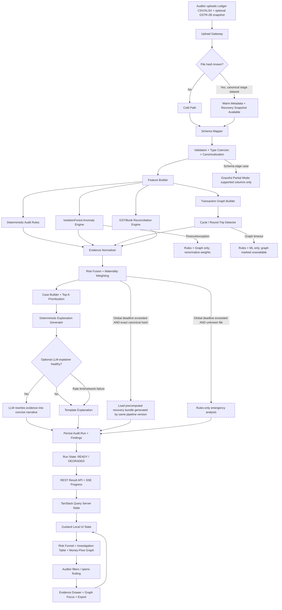
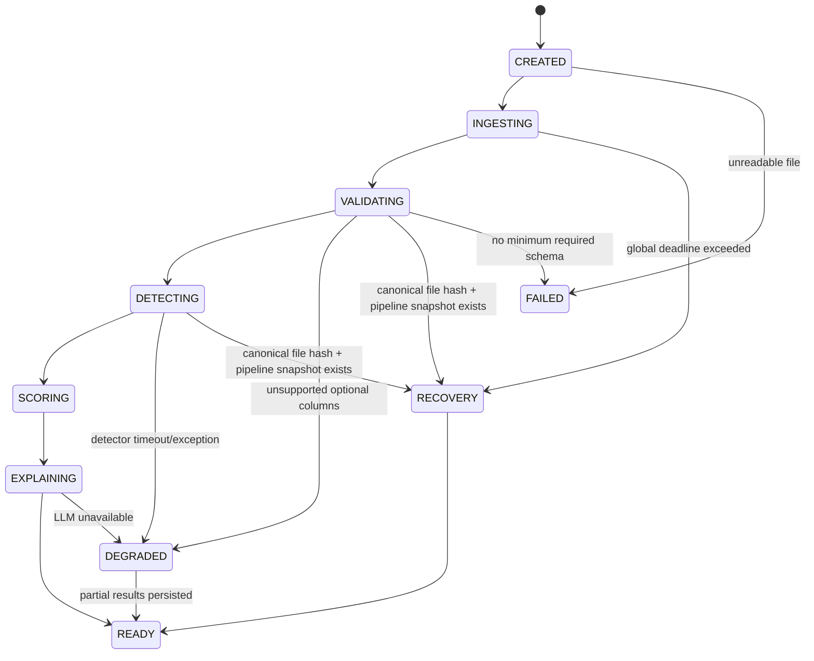
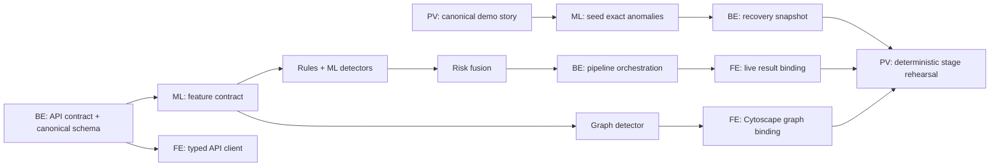
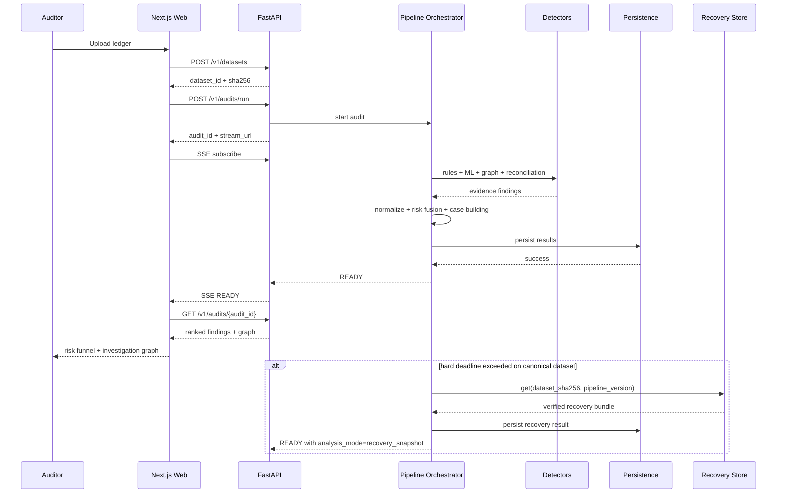

# AuditGraph: Explainable Multi-Engine Financial Anomaly Triage for SME Audits

> **Technical hook:** Convert a high-volume ledger into a ranked set of explainable audit investigations by fusing deterministic audit rules, unsupervised anomaly detection, graph-cycle analysis, and materiality-aware risk scoring.

---

## 0. Source Boundary, Design Thesis, and Non-Goals

### Source boundary
The hackathon problem statement requires an AI-powered audit analytics platform for Chartered Accountants handling SME audits, with detection and prioritization of suspicious patterns including duplicate transactions, round-tripping, backdated entries, GST-to-book mismatches, unusual month-end spikes, and other anomalies, while providing explainable risk-based insights.

Everything below is the engineering architecture proposed to satisfy that requirement; the exact algorithms, thresholds, service boundaries, UI, data model, deployment choices, and performance targets are implementation decisions rather than claims made by the source document.

### Technical thesis
A single model is the wrong abstraction for audit triage.

- **Rules** are strong for known audit red flags but weak for unseen multivariate behavior.
- **Unsupervised ML** finds statistical outliers but cannot, by itself, explain accounting significance.
- **Graph analysis** exposes relational patterns such as circular flows that row-wise models miss.
- **LLMs** are useful for natural-language explanation, but must never be the source of truth for detection.

AuditGraph therefore uses a **hybrid evidence ensemble** where every final risk score is backed by machine-readable evidence.

### Non-goals
AuditGraph does **not**:

1. declare that a transaction is fraudulent;
2. replace a Chartered Accountant or statutory audit procedure;
3. depend on a live government, ERP, banking, GST, or LLM API for its core stage demo;
4. claim production readiness from a hackathon prototype;
5. use generated prose as the detector of record.

---

# PART 1 — EXECUTION RUNBOOK & MERMAID FLOWCHARTS

## 1. Complete System Flowchart



### Stage-resilience rule
The fallback path is **not fabricated data**. The canonical demo dataset is hashed before the event; its recovery bundle is generated ahead of time by the same pipeline commit and stored with `{dataset_sha256, pipeline_version}`. If live computation exceeds the hard deadline, the backend can return that verified prior result using the identical API contract. The UI does not crash or change screens. If judges explicitly ask whether the current result came from fresh compute, answer truthfully.

---

## 2. Runtime State Machine



**Invariant:** a single detector failure must never transition the entire audit run to `FAILED`. `FAILED` is reserved for inputs that cannot be analyzed at all.

---

## 3. 30-Hour Parallelized Blitz Timeline

### Team roles

- **FE — Frontend / Visualization:** Next.js, charts, Cytoscape, interaction state, responsive stage UI.
- **BE — Backend / Infra:** FastAPI, upload, persistence, job state, caching, deployment, logging.
- **ML — ML / Audit Logic:** feature engineering, rules, IsolationForest, graph analysis, scoring, seeded test data.
- **PV — Pitch / Visuals / QA:** problem framing, test cases, slide assets, stage choreography, demo dataset, judge Q&A.

### Critical path



### Who blocks whom

1. **BE blocks FE and ML during Hour 0–1 only** until canonical transaction fields and API response shape are frozen.
2. **ML blocks BE integration during Hours 6–10** until all detector functions return the shared `DetectorFinding` interface.
3. **ML graph output blocks FE graph visualization** until a stable node/edge JSON contract exists; therefore freeze that contract by Hour 10 even if graph scoring improves later.
4. **PV blocks the final demo dataset** if the story is not frozen by Hour 4. PV must specify exactly which 4 anomalies will be demonstrated.
5. **No one may block Phase 4.** At Hour 22, feature work stops; only bug fixes, fixture hardening, and rehearsal are allowed.

---

## Phase 1 — Core Pipeline & Scaffolding (Hours 0–6)

| Hour | FE — Frontend | BE — Backend/Infra | ML — Logic | PV — Pitch/Visuals | Dependency Gate |
|---|---|---|---|---|---|
| 0–1 | Create Next.js shell, route skeleton, design tokens | Freeze repo structure, Pydantic models, API contract | Freeze canonical ledger schema + anomaly taxonomy | Freeze one-sentence product claim + 4 demo findings | **API/schema freeze at H1** |
| 1–2 | Build upload panel + progress shell | Implement `/health`, `/v1/datasets`, file hashing | Build schema mapper + type coercion | Create judge-objection list; define dataset narrative | FE consumes BE mock response |
| 2–3 | Build KPI cards + risk funnel placeholders | Implement audit-run state machine + persistence adapter | Build seeded synthetic ledger generator | Validate anomaly examples with human-readable story | ML generator must output canonical schema |
| 3–4 | Build findings table with local fixture | Wire SSE/polling progress endpoint | Implement duplicate, round-number, period-end rules | Lock demo dataset row count and four hero cases | **Hero cases frozen at H4** |
| 4–5 | Implement finding drawer shell | Add structured logs, request IDs, exception envelopes | Implement backdating, reversal, rare-counterparty rules | Draft first 30 sec + last 30 sec pitch | BE error contract blocks FE empty/error states |
| 5–6 | Connect frontend to staging API | Deploy backend staging + Postgres/DuckDB setup | Unit-test deterministic rules | First integration smoke script | **Phase gate:** upload → rule findings → UI table works |

**Phase 1 exit criteria**

- A file can be uploaded and converted into the canonical schema.
- At least four deterministic detectors execute successfully.
- Backend returns structured findings.
- Frontend renders live findings, not hard-coded screenshots.
- Canonical dataset SHA-256 is fixed.

---

## Phase 2 — Core Differentiator / Algorithm (Hours 6–16)

| Hour | FE — Frontend | BE — Backend/Infra | ML — Logic | PV — Pitch/Visuals | Dependency Gate |
|---|---|---|---|---|---|
| 6–7 | Build risk-severity UI tokens | Add orchestration service | Feature builder v1 | Prepare technical-architecture slide draft | Feature names frozen by H7 |
| 7–8 | Add detector reason chips | Add detector timing metrics | IsolationForest v1 + normalization | Design “100k → top 31” visual | ML returns normalized 0–1 score |
| 8–9 | Build anomaly distribution chart | Add per-detector timeout wrapper | Evaluate Precision@K on injected anomalies | Record baseline vs ensemble comparison | **ML benchmark checkpoint** |
| 9–10 | Start Cytoscape component | Freeze graph JSON schema | Graph builder + directed weighted edges | Prepare hero round-trip scenario | **Graph contract freeze H10** |
| 10–11 | Render graph nodes/edges from fixture | Add graph endpoint/result embedding | Cycle detection, amount-similarity, time-window scoring | Write exact graph narration | ML graph output unblocks FE graph |
| 11–12 | Add graph focus/hover evidence | Add result persistence | Materiality score + risk fusion | Build demo checklist | Risk score formula frozen H12 |
| 12–13 | Connect graph to live finding | Add fallback manager | Missing-detector weight renormalization | Rehearse first 90 seconds | **Core differentiator visible H13** |
| 13–14 | Build evidence drawer | Optional LLM adapter + circuit breaker | Deterministic explanation templates | Create kill-question cards | LLM must remain non-critical |
| 14–15 | Add GST mismatch UI | Add optional second-file upload | GST/book reconciliation | Verify GST example wording | Optional path only; cannot block core |
| 15–16 | End-to-end integration fixes | Generate canonical recovery bundle | Full ensemble benchmark + bug fixes | 2-minute internal pitch dry run | **Phase gate:** one-click full hero demo works |

**Phase 2 exit criteria**

- Real rule engine, real IsolationForest, real graph-cycle detector.
- Risk score contains evidence from available detectors.
- A round-trip finding opens an interactive money-flow graph.
- Recovery bundle exists for the exact canonical dataset and exact pipeline version.
- Optional LLM can be unplugged with no demo degradation.

---

## Phase 3 — Integration & Wow-Factor UI Polish (Hours 16–22)

| Hour | FE — Frontend | BE — Backend/Infra | ML — Logic | PV — Pitch/Visuals | Dependency Gate |
|---|---|---|---|---|---|
| 16–17 | Animate analysis funnel | Warm canonical dataset/cache | Lock detector thresholds | Match pitch words to actual UI | No new detectors after H17 |
| 17–18 | Polish graph animation and focus states | Add `/readyz`, `/version`, cache health | Fix only benchmark regressions | Record backup demo video locally | **Recovery assets complete** |
| 18–19 | Responsive projector layout | Add stage-mode env config | Validate 10 edge-case fixtures | Finalize architecture slide | Stage resolution test |
| 19–20 | Empty/loading/degraded states | Failure injection switches | Run failure injection tests | Rehearse with network disabled | **Offline demo must pass** |
| 20–21 | Export investigation report button | Freeze API schemas | Freeze model/scoring constants | Full 3-minute pitch rehearsal | **API/code contract freeze H21** |
| 21–22 | Pixel polish only | Build release artifact/tag | Generate benchmark JSON | Freeze slides and speaking order | **HARD CODE FREEZE at H22** |

---

## Phase 4 — Hard Code Freeze, Smoke Testing & Stage Rehearsal (Hours 22–30)

| Hour | FE | BE | ML | PV | Mandatory output |
|---|---|---|---|---|---|
| 22–23 | No features; fix Sev-1 only | Tag `stage-v1` | Lock fixtures | Rehearse | Immutable stage build |
| 23–24 | Test Chrome + projector | Cold-start timing test | Verify benchmark checksum | 3-minute timed run | Pass #1 |
| 24–25 | Test fallback screens | Kill LLM/network intentionally | Validate rules-only mode | Continue speaking through injected failure | Pass #2 |
| 25–26 | Test canonical upload 5× | Restart backend 5× | Compare output hashes | Judge Q&A round | Stability report |
| 26–27 | Laptop power/battery/browser cache | Local backup server | Copy dataset + result bundle to 2 locations | Backup video on local disk | Disaster kit |
| 27–28 | Zero changes | Zero changes | Zero changes | 5 consecutive stage rehearsals | 5/5 pass |
| 28–29 | Rest / watch logs only | Rest / watch logs only | Rest / watch logs only | Tighten wording only | No code churn |
| 29–30 | Final launch check | Final health check | Final checksum | One final rehearsal | Ready for judging |

### If the hackathon is exactly 24 hours
Do not compress Phases 1–3. Compress Phase 4 to Hours 22–24, but still enforce the hard freeze at Hour 22.

---

# PART 2 — MIT-LEVEL `MASTER.md` REPOSITORY DOCUMENTATION

# AuditGraph: Explainable Multi-Engine Financial Anomaly Triage for SME Audits

## 1. Abstract & Mathematical / Technical Formulation

### 1.1 Problem formalization

Let a ledger contain transactions

\[
\mathcal{T} = \{t_1, t_2, \ldots, t_n\}
\]

where each transaction is mapped into a canonical representation containing monetary, temporal, accounting, counterparty, tax, provenance, and posting-context attributes.

For each transaction \(t_i\), AuditGraph seeks a risk-priority score

\[
S_i \in [0,100]
\]

and an evidence set

\[
E_i = \{e_{i1}, e_{i2}, \ldots, e_{ik}\}
\]

such that auditors can rank transactions by review priority without treating \(S_i\) as a fraud probability.

The system computes four evidence families:

1. **Rule evidence** \(R_i\): deterministic accounting or audit red flags.
2. **Statistical anomaly evidence** \(M_i\): unsupervised deviation from peer behavior.
3. **Relational graph evidence** \(G_i\): suspicious flow structure involving entities and transactions.
4. **Materiality evidence** \(Q_i\): magnitude relative to configured audit materiality and peer distributions.

A detector-availability-aware fusion score is

\[
S_i = 100 \cdot \frac{\sum_{d \in A_i} w_d s_{id}}{\sum_{d \in A_i} w_d}
\]

where:

- \(A_i\) is the set of detectors available for transaction \(i\),
- \(s_{id} \in [0,1]\) is the detector score,
- \(w_d > 0\) is the detector weight.

This normalization is critical: if graph fields are unavailable or a detector times out, risk scores remain mathematically valid rather than collapsing toward zero.

### 1.2 Why naive baselines fail

#### Baseline A — fixed threshold rules only
A rules-only system catches known conditions such as duplicate invoices or end-of-period entries, but fails when risk is distributed across weak signals. Example: a transaction may be only moderately large, slightly unusual for a vendor, posted at an unusual time, and linked to a rare counterparty. None of those alone crosses a threshold.

#### Baseline B — unsupervised anomaly model only
IsolationForest or another outlier detector can rank unusual rows but does not understand accounting semantics. It may rank a legitimate one-off capital purchase above a suspicious but statistically common manipulation pattern.

#### Baseline C — LLM over raw ledger
This is rejected architecturally. It is expensive, nondeterministic, difficult to validate, vulnerable to context-window limits, and unsuitable as the authoritative detector.

#### Baseline D — row-only analytics
Round-tripping is a relational property. The suspicious object is not one row but a path/cycle through multiple counterparties. A graph representation is required.

### 1.3 Technical thesis

AuditGraph is a **hybrid decision-support architecture**:

\[
\text{Audit Priority} = f(\text{Rules},\text{ML},\text{Graph},\text{Materiality})
\]

with a strict separation between:

- **detection** — numerical and deterministic computation;
- **explanation** — natural-language rendering of already-computed evidence.

### 1.4 Detector mathematics

#### Deterministic rule score
For binary or graded rules \(r_{ij} \in [0,1]\):

\[
R_i = \frac{\sum_j \alpha_j r_{ij}}{\sum_j \alpha_j}
\]

Example rule weights:

| Rule | Weight |
|---|---:|
| Exact duplicate | 1.00 |
| Near duplicate | 0.75 |
| Backdated entry | 0.70 |
| Period-end posting | 0.45 |
| Suspicious round amount | 0.30 |
| Rapid reversal | 0.80 |
| Rare counterparty | 0.45 |
| GST/book mismatch | 0.90 |

Weights are stage configuration values, not fraud probabilities.

#### IsolationForest anomaly score
Let sklearn return a decision function \(d_i\) where lower values are more abnormal. Convert to a monotonic risk score:

\[
M_i = \operatorname{clip}\left(\frac{q_{95}(d)-d_i}{q_{95}(d)-q_{05}(d)}, 0, 1\right)
\]

where \(q_{05}\) and \(q_{95}\) are robust quantiles computed on the current ledger.

#### Graph round-trip score
For a transaction participating in a directed cycle \(c\):

\[
G_i = \sigma(\beta_0 + \beta_1 I_{cycle} + \beta_2 A_c + \beta_3 T_c + \beta_4 R_c)
\]

where:

- \(I_{cycle}\) = cycle participation indicator;
- \(A_c = 1 - \min(CV_{amount}, 1)\), so similar transfer amounts increase suspicion;
- \(T_c = e^{-\Delta t/\tau}\), so tighter temporal cycles score higher;
- \(R_c\) = counterparty rarity score;
- \(\sigma\) is the logistic function.

For stage simplicity, coefficients may be manually configured rather than statistically trained.

#### Materiality score
For configured materiality threshold \(m > 0\):

\[
Q_i = \min\left(1, \frac{\log(1+|amount_i|)}{\log(1+2m)}\right)
\]

This prevents a single extreme transaction from numerically dominating all other evidence.

### 1.5 Default risk fusion

```text
rules       = 0.35
ml          = 0.25
graph       = 0.25
materiality = 0.15
```

Severity bands:

```text
0–39   LOW
40–69  MEDIUM
70–84  HIGH
85–100 CRITICAL
```

### 1.6 Engineering targets

These are **hackathon engineering targets**, not measured production claims.

| Metric | Target |
|---|---:|
| Canonical demo ledger size | 100,000 rows |
| Rule + feature pass | ≤ 2.5 s on stage laptop |
| Full pipeline excluding optional LLM | ≤ 8 s p95 |
| Cached canonical recovery response | ≤ 500 ms |
| Frontend interaction after results load | ≤ 100 ms perceived |
| Deterministic rule recall on seeded anomalies | ≥ 95% for supported rule classes |
| Precision@20 on seeded mixed anomalies | ≥ 85% target |
| Core pipeline external API dependency | 0 |
| Stage demo success across 5 consecutive rehearsals | 5/5 |
| First-pass review-volume reduction target | 80–95% fewer rows surfaced for manual triage |

**Do not call the last metric “audit cost savings” unless measured in a real pilot.** It is a triage-volume target.

---

## 2. Micro-Architecture & Data Flow

### 2.1 Repository layout

```text
auditgraph/
├── apps/
│   ├── web/
│   │   ├── app/
│   │   │   ├── page.tsx
│   │   │   ├── audits/[auditId]/page.tsx
│   │   │   └── api-health/page.tsx
│   │   ├── components/
│   │   │   ├── upload/UploadDropzone.tsx
│   │   │   ├── dashboard/RiskFunnel.tsx
│   │   │   ├── dashboard/FindingsTable.tsx
│   │   │   ├── graph/MoneyFlowGraph.tsx
│   │   │   ├── finding/EvidenceDrawer.tsx
│   │   │   └── system/RunStatusBadge.tsx
│   │   ├── lib/api.ts
│   │   ├── lib/types.ts
│   │   └── stores/uiStore.ts
│   └── api/
│       ├── app/main.py
│       ├── api/routes/datasets.py
│       ├── api/routes/audits.py
│       ├── api/routes/health.py
│       ├── domain/models.py
│       ├── ingest/schema_mapper.py
│       ├── ingest/validator.py
│       ├── features/builder.py
│       ├── detectors/base.py
│       ├── detectors/rules.py
│       ├── detectors/isolation.py
│       ├── detectors/graph_cycles.py
│       ├── detectors/gst_reconcile.py
│       ├── scoring/risk_fusion.py
│       ├── cases/case_builder.py
│       ├── explain/template_explainer.py
│       ├── explain/llm_explainer.py
│       ├── orchestration/pipeline.py
│       ├── resilience/fallbacks.py
│       ├── resilience/recovery_store.py
│       ├── persistence/repository.py
│       └── observability/metrics.py
├── data/
│   ├── demo/auditgraph_demo_100k.csv
│   ├── demo/gstr2b_demo.csv
│   └── fixtures/
├── scripts/
│   ├── generate_demo.py
│   ├── build_recovery_snapshot.py
│   ├── smoke_test.py
│   └── failure_injection_test.py
├── tests/
│   ├── unit/
│   ├── integration/
│   └── golden/
├── docker-compose.yml
├── .env.stage.example
├── README.md
└── MASTER.md
```

### 2.2 Component responsibilities and boundaries

| Module | Owns | Must not own |
|---|---|---|
| `schema_mapper` | column aliases, canonical names, type coercion | anomaly decisions |
| `validator` | required-field checks, quality warnings | business scoring |
| `feature_builder` | numeric/time/vendor/account features | severity labels |
| `rules` | deterministic audit flags + evidence | UI text |
| `isolation` | unsupervised anomaly score | fraud classification |
| `graph_cycles` | entity graph + cycle evidence | generic row outliers |
| `gst_reconcile` | uploaded books vs uploaded GST snapshot matching | live government scraping |
| `risk_fusion` | detector normalization + weighted score | natural-language generation |
| `case_builder` | grouping related findings into investigations | detector execution |
| `template_explainer` | deterministic evidence sentences | new facts |
| `llm_explainer` | optional language rewrite | risk score mutation |
| `pipeline` | ordering, deadlines, partial failure policy | detector internals |
| `recovery_store` | hash/version keyed verified snapshots | arbitrary fake responses |
| frontend | rendering and interactions | recomputing authoritative scores |

### 2.3 Canonical transaction schema

Minimum required columns:

| Field | Type | Required | Example |
|---|---|---:|---|
| `transaction_id` | string | yes | `TXN-00010482` |
| `posting_date` | ISO date | yes | `2026-03-29` |
| `amount` | decimal | yes | `495000.00` |
| `debit_account` | string | yes | `Vendor Advances` |
| `credit_account` | string | yes | `HDFC Current Account` |
| `currency` | string | yes | `INR` |

High-value optional columns:

| Field | Type | Example |
|---|---|---|
| `document_date` | ISO date/null | `2026-02-14` |
| `vendor_id` | string/null | `VEN-441` |
| `customer_id` | string/null | `CUS-117` |
| `source_entity_id` | string/null | `COMPANY-A` |
| `destination_entity_id` | string/null | `VENDOR-X` |
| `invoice_id` | string/null | `INV-2026-8812` |
| `invoice_date` | ISO date/null | `2026-03-28` |
| `gstin` | string/null | `27ABCDE1234F1Z5` |
| `user_id` | string/null | `USR-019` |
| `entry_mode` | enum | `manual` |
| `description` | string | `Year-end vendor advance` |
| `tax_amount` | decimal/null | `89100.00` |
| `reference_id` | string/null | `REF-778180` |

### 2.4 Internal detector interface

Every detector returns the same shape:

```python
@dataclass(frozen=True)
class DetectorFinding:
    transaction_id: str
    detector: str
    score: float                 # 0.0 to 1.0
    rule_code: str
    evidence: dict[str, Any]
    related_transaction_ids: list[str]
    related_entity_ids: list[str]
```

Detector contract:

```python
class Detector(Protocol):
    name: str
    def run(self, frame: pd.DataFrame, ctx: AuditContext) -> list[DetectorFinding]: ...
```

### 2.5 Primary API contract

#### `POST /v1/audits/run`

Request:

```json
{
  "dataset_id": "ds_ign8_demo_v1",
  "audit_name": "FY26 SME Ledger Review",
  "fiscal_year_start": "2025-04-01",
  "fiscal_year_end": "2026-03-31",
  "materiality_amount_inr": 250000,
  "top_k_cases": 50,
  "detectors": {
    "rules": true,
    "isolation_forest": true,
    "graph_cycles": true,
    "gst_reconciliation": true
  },
  "risk_weights": {
    "rules": 0.35,
    "ml": 0.25,
    "graph": 0.25,
    "materiality": 0.15
  },
  "graph": {
    "max_cycle_hops": 4,
    "max_cycle_window_hours": 72,
    "amount_similarity_tolerance": 0.08
  },
  "ml": {
    "contamination": 0.015,
    "n_estimators": 200,
    "random_state": 42
  },
  "explanation_mode": "deterministic_first",
  "hard_deadline_ms": 8000
}
```

Accepted response:

```json
{
  "audit_id": "aud_01JX9F2R8N4G6Y3A7K2P5M1Q0T",
  "dataset_id": "ds_ign8_demo_v1",
  "status": "INGESTING",
  "created_at": "2026-09-03T08:24:16.321Z",
  "stream_url": "/v1/audits/aud_01JX9F2R8N4G6Y3A7K2P5M1Q0T/events",
  "result_url": "/v1/audits/aud_01JX9F2R8N4G6Y3A7K2P5M1Q0T",
  "request_id": "req_7b5f2d98f6a24c4f"
}
```

#### Final `GET /v1/audits/{audit_id}` response

```json
{
  "audit_id": "aud_01JX9F2R8N4G6Y3A7K2P5M1Q0T",
  "status": "READY",
  "analysis_mode": "live_full",
  "pipeline_version": "stage-v1.0.0+3f91c6a",
  "dataset_sha256": "25f8658431d16c167cd4dbd6c2c7d553c1b50c2c80bcf0f7c892c3f4c5d64f02",
  "summary": {
    "transaction_count": 100284,
    "total_value_inr": 842315900.50,
    "initial_flags": 731,
    "unique_flagged_transactions": 142,
    "low": 63,
    "medium": 48,
    "high": 23,
    "critical": 8,
    "analysis_duration_ms": 4872
  },
  "detectors": [
    {
      "name": "rules",
      "status": "ok",
      "duration_ms": 612,
      "finding_count": 391
    },
    {
      "name": "isolation_forest",
      "status": "ok",
      "duration_ms": 944,
      "finding_count": 176
    },
    {
      "name": "graph_cycles",
      "status": "ok",
      "duration_ms": 1281,
      "finding_count": 24
    },
    {
      "name": "gst_reconciliation",
      "status": "ok",
      "duration_ms": 307,
      "finding_count": 17
    }
  ],
  "top_cases": [
    {
      "case_id": "case_roundtrip_001",
      "title": "Three-entity circular payment near year end",
      "severity": "CRITICAL",
      "risk_score": 96.2,
      "primary_transaction_id": "TXN-00088412",
      "transaction_ids": [
        "TXN-00088412",
        "TXN-00088419",
        "TXN-00088427"
      ],
      "entity_ids": [
        "COMPANY-A",
        "VENDOR-X",
        "VENDOR-Y"
      ],
      "amount_exposure_inr": 1492500.00,
      "evidence": [
        {
          "code": "GRAPH_CYCLE",
          "label": "Circular flow detected",
          "value": "COMPANY-A → VENDOR-X → VENDOR-Y → COMPANY-A"
        },
        {
          "code": "AMOUNT_SIMILARITY",
          "label": "Transfer amounts are highly similar",
          "value": "₹4.95L, ₹4.90L, ₹4.875L"
        },
        {
          "code": "TEMPORAL_COMPACTNESS",
          "label": "Entire cycle completed quickly",
          "value": "36 hours"
        },
        {
          "code": "PERIOD_END",
          "label": "Sequence occurred near fiscal year end",
          "value": "2 days before 2026-03-31"
        }
      ],
      "explanation": "This investigation was prioritized because three entities form a circular payment path within 36 hours, the transfer amounts are closely matched, and the sequence occurs two days before fiscal year end. The pattern requires auditor review; it is not classified as fraud by the system.",
      "graph": {
        "nodes": [
          {
            "id": "COMPANY-A",
            "label": "Company A",
            "kind": "company"
          },
          {
            "id": "VENDOR-X",
            "label": "Vendor X",
            "kind": "vendor"
          },
          {
            "id": "VENDOR-Y",
            "label": "Vendor Y",
            "kind": "vendor"
          }
        ],
        "edges": [
          {
            "id": "edge-1",
            "source": "COMPANY-A",
            "target": "VENDOR-X",
            "transaction_id": "TXN-00088412",
            "amount_inr": 495000.00,
            "posted_at": "2026-03-29T10:12:00Z"
          },
          {
            "id": "edge-2",
            "source": "VENDOR-X",
            "target": "VENDOR-Y",
            "transaction_id": "TXN-00088419",
            "amount_inr": 490000.00,
            "posted_at": "2026-03-30T02:08:00Z"
          },
          {
            "id": "edge-3",
            "source": "VENDOR-Y",
            "target": "COMPANY-A",
            "transaction_id": "TXN-00088427",
            "amount_inr": 487500.00,
            "posted_at": "2026-03-30T22:01:00Z"
          }
        ]
      }
    }
  ],
  "warnings": [],
  "recovery": {
    "used": false,
    "reason": null
  }
}
```

### 2.6 Standard error envelope

```json
{
  "error": {
    "code": "DATASET_SCHEMA_UNSUPPORTED",
    "message": "The uploaded ledger is missing required canonical fields: posting_date and amount.",
    "recoverable": true,
    "required_fields": [
      "transaction_id",
      "posting_date",
      "amount",
      "debit_account",
      "credit_account",
      "currency"
    ],
    "request_id": "req_7b5f2d98f6a24c4f"
  }
}
```

### 2.7 Data flow sequence



### 2.8 Frontend state boundaries

**TanStack Query** owns server state:

- audit run result;
- audit status;
- findings list;
- graph payload;
- export status.

**Zustand** owns local interaction state only:

- selected severity filters;
- selected case ID;
- graph focus node;
- sort mode;
- evidence drawer open/closed;
- presentation mode.

**Rule:** do not duplicate authoritative audit results into Zustand.

### 2.9 Persistence strategy

For the stage MVP:

- Postgres/Supabase stores audit metadata, findings metadata, run versions, and snapshot indexes.
- DuckDB or Polars/Pandas handles columnar analysis in-process.
- Original uploaded files are stored locally or in object storage depending deployment.
- Recovery bundle is a compressed JSON artifact keyed by SHA-256 + pipeline version.

Suggested tables:

```text
datasets(dataset_id, sha256, row_count, uploaded_at, storage_uri)
audit_runs(audit_id, dataset_id, status, analysis_mode, pipeline_version, duration_ms, created_at)
findings(finding_id, audit_id, transaction_id, detector, score, severity, evidence_json)
cases(case_id, audit_id, title, risk_score, severity, explanation, graph_json)
recovery_snapshots(sha256, pipeline_version, result_uri, result_sha256, created_at)
```

### 2.10 Observability

Every run logs:

```text
request_id
audit_id
dataset_sha256
pipeline_version
row_count
phase
detector_name
duration_ms
finding_count
fallback_used
exception_class
```

Never log full ledger rows in stage telemetry.

---

## 3. The Stage MVP Strategic Boundary

### 3.1 Real vs Mocked matrix

| Component | Production Truth — What Actually Runs | Controlled Demo Reality — What We Cache/Mock | Why This Avoids Demo Crash |
|---|---|---|---|
| Ledger upload | Real CSV/XLSX ingestion, file hashing, schema mapping | Canonical stage CSV is prevalidated | Prevents malformed-file surprises |
| Rule engine | Real deterministic Python detectors | Nothing mocked | Core evidence remains live and defensible |
| IsolationForest | Real sklearn model fit/run on uploaded ledger | Random seed and parameters frozen | Deterministic stage behavior |
| Graph analysis | Real directed graph + cycle detection | Canonical dataset contains known cycle examples | Guarantees an interpretable hero case exists |
| Risk fusion | Real weighted normalization with missing-detector renormalization | Weights frozen in stage config | Prevents last-minute tuning drift |
| Explanation | Real deterministic templates; optional LLM rewrite | Stage can run with LLM disabled | External API can fail with zero demo impact |
| GST comparison | Real comparison of two uploaded files | GSTR-2B is a prepared snapshot file, not a live GST API | Avoids auth/network/legal integration risk |
| ERP/Tally/SAP connector | Not implemented in stage core | Architecture cards / static integration mock | Avoids wasting time on vendor auth |
| Authentication | Minimal stage session | Demo user seeded | Removes SSO failure risk |
| Notifications | Not core | UI notification preview only | No SMS/email dependency |
| Canonical full result | Normally computed live | Precomputed recovery bundle for exact SHA-256 + pipeline version | Preserves stage continuity if compute path exceeds deadline |
| Dashboard | Real live API binding | Skeleton fixtures only used during development | Stage UI is not a screenshot demo |

### 3.2 Single killer visual

**The first 20 seconds must show a compression funnel and immediately open the highest-risk money-flow graph.**

```text
100,284 transactions
      ↓
731 machine/rule flags
      ↓
142 unique suspicious transactions
      ↓
31 high/critical priorities
      ↓
#1: circular money flow, 96/100 risk
```

Then the judge sees:

```text
Company A ──₹4.95L──▶ Vendor X
    ▲                    │
    │                    │ ₹4.90L
    │                    ▼
    └────₹4.875L──── Vendor Y
```

Beside it, show four evidence chips:

```text
CIRCULAR FLOW
36-HOUR WINDOW
AMOUNT SIMILARITY
YEAR-END TIMING
```

That single visual communicates scale, intelligence, relational reasoning, and explainability without requiring the judge to understand IsolationForest.

---

## 4. Disaster Recovery & Demo Smoke Test

### 4.1 Catastrophic failure #1 — optional LLM API rate limit or network loss

**Failure mode:** explanation endpoint returns 429/5xx, DNS fails, internet is unavailable.

**Architectural prevention:** LLM is post-processing only.

Code-level policy:

```python
async def explain_case(case: AuditCase) -> str:
    deterministic = template_explainer.render(case.evidence)

    if settings.stage_disable_llm:
        return deterministic

    try:
        return await asyncio.wait_for(
            llm_explainer.rewrite(deterministic),
            timeout=1.2,
        )
    except Exception:
        metrics.increment("llm_fallback")
        return deterministic
```

**Stage guarantee:** detection, scoring, graphs, and explanations remain available offline.

---

### 4.2 Catastrophic failure #2 — latency spike / graph detector stalls

**Failure mode:** cycle analysis on an unexpected graph exceeds the stage latency budget.

**Code-level containment:** each detector receives an independent time budget and returns partial results.

```python
DETECTOR_TIMEOUTS = {
    "rules": 1.5,
    "isolation_forest": 2.0,
    "graph_cycles": 2.5,
    "gst_reconciliation": 1.0,
}

async def safe_detector_run(detector, frame, ctx):
    try:
        return await asyncio.wait_for(
            asyncio.to_thread(detector.run, frame, ctx),
            timeout=DETECTOR_TIMEOUTS[detector.name],
        )
    except Exception as exc:
        return DetectorExecution(
            name=detector.name,
            status="unavailable",
            findings=[],
            error=type(exc).__name__,
        )
```

Risk fusion renormalizes over available detectors:

```python
def fuse(scores: dict[str, float | None], weights: dict[str, float]) -> float:
    active = [(name, score) for name, score in scores.items() if score is not None]
    denominator = sum(weights[name] for name, _ in active)
    if denominator == 0:
        return 0.0
    return 100.0 * sum(weights[name] * score for name, score in active) / denominator
```

**Stage guarantee:** graph failure degrades technical depth but does not produce a blank dashboard.

---

### 4.3 Catastrophic failure #3 — schema/edge-case bug or global pipeline deadline

**Failure mode:** unexpected nulls, dtype coercion, or a rare edge case causes a pipeline exception; alternatively total runtime exceeds 8 seconds on stage.

**Prevention layers:**

1. canonical schema mapping;
2. detector-level exception isolation;
3. global deadline;
4. exact-hash recovery snapshot;
5. rules-only emergency path for unknown files.

Pseudo-code:

```python
async def run_with_recovery(req: AuditRunRequest, dataset: DatasetRef):
    key = RecoveryKey(
        dataset_sha256=dataset.sha256,
        pipeline_version=PIPELINE_VERSION,
    )

    try:
        result = await asyncio.wait_for(
            live_pipeline(req, dataset),
            timeout=req.hard_deadline_ms / 1000,
        )
        result.analysis_mode = "live_full"
        return result
    except Exception as exc:
        snapshot = recovery_store.get_verified(key)
        if snapshot is not None:
            snapshot.analysis_mode = "recovery_snapshot"
            snapshot.recovery = {
                "used": True,
                "reason": type(exc).__name__,
            }
            return snapshot

        return await rules_only_emergency_pipeline(req, dataset)
```

**Integrity constraint:** recovery snapshot may only be used when both dataset SHA-256 and pipeline version match exactly.

---

### 4.4 Smoke test contract

Run this before every rehearsal:

```bash
python scripts/smoke_test.py \
  --dataset data/demo/auditgraph_demo_100k.csv \
  --gstr2b data/demo/gstr2b_demo.csv \
  --base-url http://127.0.0.1:8000 \
  --expected-min-critical 5 \
  --expected-case case_roundtrip_001 \
  --max-duration-ms 8000
```

Smoke test asserts:

1. `/health` returns 200;
2. canonical dataset SHA-256 matches expected value;
3. upload succeeds;
4. run reaches `READY` or `DEGRADED`, never `FAILED`;
5. result count is 100,284;
6. `case_roundtrip_001` exists;
7. top case has graph nodes and edges;
8. no risk score is NaN/inf;
9. all risk scores are in `[0,100]`;
10. explanation contains only evidence-backed facts;
11. p95-equivalent single-run duration is below stage budget;
12. recovery path succeeds when failure injection is enabled.

### 4.5 Failure-injection rehearsal matrix

```text
DEMO_FAIL_LLM=1            → expected: deterministic explanation, full result
DEMO_FAIL_GRAPH=1          → expected: READY/DEGRADED, graph detector unavailable, no crash
DEMO_FORCE_TIMEOUT=1       → expected: recovery_snapshot for canonical file
DEMO_BAD_OPTIONAL_COL=1    → expected: schema warning, supported detectors continue
NETWORK_DISABLED=1         → expected: full core demo still works
```

### 4.6 Golden fixture tests

Minimum fixtures:

| Fixture | Expected finding |
|---|---|
| duplicate pair | `EXACT_DUPLICATE` |
| same invoice, slightly changed amount | `NEAR_DUPLICATE` |
| document date 20 days before posting | `BACKDATED_POSTING` |
| equal reverse entry within 48h | `RAPID_REVERSAL` |
| 3-node circular transfer | `GRAPH_CYCLE` |
| book entry absent from GST snapshot | `GST_BOOK_MISMATCH` |
| normal high-value capex | may be ML outlier but must not receive deterministic fraud wording |
| missing graph fields | graph disabled, risk fusion renormalized |

---

## 5. Three-Minute Grand Championship Pitch Script

### 0–30 seconds — Visceral pain hook

> “An SME auditor can receive one lakh ledger entries for a single engagement. The problem is not access to data; the problem is deciding what deserves human attention. A duplicate invoice, a backdated journal, a GST mismatch, and a circular payment can be buried inside thousands of normal rows. AuditGraph compresses that search space into a ranked investigation queue — and every flag comes with evidence.”

On screen: upload `auditgraph_demo_100k.csv`.

> “I’m uploading 100,284 transactions now.”

Do not explain the architecture yet.

---

### 30–90 seconds — Live demo: show, do not tell

As the funnel animates:

> “The ledger is canonicalized, analyzed, and reduced from 100,284 transactions to 142 suspicious transactions, with 31 ranked high or critical.”

Click the top case.

> “This is our highest-risk investigation. AuditGraph found a three-entity circular payment: Company A pays Vendor X, Vendor X pays Vendor Y, and Vendor Y routes a similar amount back to Company A — all within 36 hours and two days before year-end.”

Point to evidence chips.

> “Notice what we are not doing: we are not calling this fraud. We are telling the auditor exactly why this pattern deserves review.”

Open second case.

> “The same pipeline also catches deterministic issues such as duplicates, backdated postings, rapid reversals, and book-to-GST mismatches.”

---

### 90–150 seconds — Technical depth and scalability

Show architecture slide.

> “The core is deliberately not one black-box model. Rules capture known audit red flags. IsolationForest finds multivariate statistical outliers. A directed transaction graph detects relational anomalies such as round-tripping. Materiality keeps findings aligned to audit significance. We then fuse only the detectors available for each transaction and attach the exact machine evidence used to compute the score.”

> “The LLM is not allowed to detect fraud or mutate risk. It only rewrites evidence into readable language, and if the network fails we fall back to deterministic templates. The core pipeline has zero required external APIs.”

> “For scale, ingestion and feature computation are columnar; independent detectors can execute in parallel; graph analysis has an explicit time budget; and results can be persisted by audit ID. A production version can move detectors onto workers without changing the frontend contract.”

---

### 150–180 seconds — Business case and visionary close

> “The user is a CA firm or finance team that currently spends skilled time searching broad ledgers before investigating the exceptions. Our target is to reduce the first-pass review surface by 80 to 95 percent while keeping the auditor in control.”

> “The commercial model is simple: a B2B audit-intelligence layer priced by engagement or transaction volume, with ERP connectors as the production expansion path.”

Return to the graph.

> “AuditGraph does not replace professional judgment. It gives professional judgment a better search engine. One lakh transactions in — the few investigations that matter out.”

Stop.

---

## 6. Top 3 Judge Kill Questions & Counter-Arguments

### Kill Question 1 — “How can you say this is fraud? What about false positives?”

**Answer:**

- We do not classify fraud.
- Our output is **review priority**, not guilt or fraud probability.
- Deterministic rule evidence and graph evidence are shown directly.
- The ML score is one input into ranking, not an autonomous decision.
- We evaluate the hackathon pipeline using seeded anomaly labels with metrics such as Precision@K and detector-specific recall, which is more appropriate than claiming generic “accuracy.”
- A real deployment would calibrate thresholds per client, ledger type, and auditor risk policy.

One-line close:

> “The model recommends where to look; the auditor determines what it means.”

---

### Kill Question 2 — “Why do you need AI? Excel rules can already find duplicates and big transactions.”

**Answer:**

- Excel can catch explicit predicates; we use those too.
- Statistical anomalies require multivariate context: amount relative to vendor history, posting timing, account rarity, transaction frequency, and peer behavior.
- Round-tripping is a graph property spanning multiple entities and rows; it cannot be represented reliably as one spreadsheet threshold.
- The value is the **fusion and prioritization** of heterogeneous evidence into a single investigation workflow.

One-line close:

> “Rules find known red flags; ML finds unusual behavior; graphs find suspicious relationships.”

---

### Kill Question 3 — “Your demo is 100k rows. What happens at 10 million?”

**Answer:**

- The API and detector contracts are already separable from execution location.
- Rules and feature generation are vectorizable and can move from Pandas to Polars/Spark/DuckDB without changing semantics.
- IsolationForest can be trained on stratified samples or per-entity partitions, then scored in batches.
- Graph construction can be scoped by time window, entity community, or transaction-materiality threshold before cycle search; unrestricted all-simple-cycle enumeration is explicitly avoided.
- In production, each detector becomes an independent worker reading the same canonical dataset and returning the same `DetectorFinding` contract.
- The UI consumes stored case results, not raw ledger rows.

One-line close:

> “The hackathon implementation is in-process; the architecture is worker-ready.”

---

# 7. Algorithmic Implementation Notes

## 7.1 Deterministic rules

### Exact duplicate
Group on:

```text
vendor_id / counterparty
invoice_id
amount
posting_date or invoice_date
```

Strong signal if count > 1.

### Near duplicate
Candidate generation:

1. same vendor;
2. amount difference ≤ 1–2%;
3. invoice string similarity ≥ configured threshold;
4. posting dates within configured window.

Use RapidFuzz only after blocking by vendor/date to avoid O(n²).

### Backdated posting

```text
posting_date - document_date >= configured_days
```

Escalate if near period end or manually entered.

### Period-end spike

Compute per-account and per-vendor historical daily volume. Flag if:

```text
last_k_days volume z-score > threshold
```

The stage version can use robust median/MAD rather than normality assumptions.

### Rapid reversal
Find opposing debit/credit or reverse entity flow with similar amount within 24–72 hours.

### Round amount
Avoid “amount divisible by 1000 = fraud.” It is only weak evidence. Score increases with materiality, rarity for that vendor/account, manual entry, and period-end proximity.

### GST-to-book mismatch
Perform normalized key matching between purchase register and uploaded GSTR-2B snapshot using:

```text
GSTIN + invoice number + invoice date + taxable value
```

Allow configured tolerances for date/amount formatting differences.

---

## 7.2 IsolationForest feature set

Recommended initial features:

```text
log_abs_amount
vendor_txn_count_30d
vendor_amount_z_robust
account_txn_count_30d
hour_of_day_sin
hour_of_day_cos
day_of_month
is_weekend
days_to_fiscal_year_end
is_manual_entry
invoice_amount_roundness
counterparty_rarity
rapid_reversal_candidate
```

Categorical identifiers should not be naïvely ordinal-encoded as if their numbers carry distance. Prefer frequency/rareness features or hashing where necessary.

---

## 7.3 Graph engine

Build a directed multigraph where:

```text
node = economic entity
edge = transfer/ledger movement
edge attrs = transaction_id, amount, timestamp, account context
```

Do **not** call `networkx.simple_cycles()` over an unrestricted million-edge graph in production.

Stage strategy:

1. filter to material / anomalous candidate edges;
2. window by 72 hours;
3. restrict cycle length to 2–4 hops;
4. find cycles in strongly connected components;
5. rank by amount similarity + temporal compactness + rarity.

---

## 7.4 Case builder

Multiple detector findings may refer to the same underlying event. Group them into one `AuditCase` using:

1. shared transaction IDs;
2. shared graph cycle ID;
3. shared invoice/vendor keys;
4. temporal proximity.

This is why the UI may show 731 raw flags but only 142 unique suspicious transactions and 31 high/critical investigations.

---

# 8. Demo Dataset Engineering

Generate 100,284 deterministic rows with `random_state=42`.

Suggested injected anomalies:

| Pattern | Count |
|---|---:|
| exact duplicates | 80 |
| near duplicates | 35 |
| backdated manual entries | 25 |
| suspicious year-end postings | 40 |
| rapid reversals | 20 |
| graph round-trip cycles | 8 cycles / 24 transactions |
| GST/book mismatches | 17 |
| rare high-value counterparties | 15 |
| benign high-value capex outliers | 10 |

The benign outliers are essential: they prevent the test set from being a cartoon where “every unusual amount is fraud.”

Store a ground-truth manifest:

```json
{
  "dataset_sha256": "25f8658431d16c167cd4dbd6c2c7d553c1b50c2c80bcf0f7c892c3f4c5d64f02",
  "seed": 42,
  "expected_cases": {
    "EXACT_DUPLICATE": 80,
    "NEAR_DUPLICATE": 35,
    "BACKDATED_POSTING": 25,
    "YEAR_END_SPIKE": 40,
    "RAPID_REVERSAL": 20,
    "GRAPH_CYCLE": 8,
    "GST_BOOK_MISMATCH": 17,
    "BENIGN_OUTLIER": 10
  },
  "hero_case_id": "case_roundtrip_001"
}
```

---

# 9. Stage Configuration

`.env.stage` intent:

```text
APP_ENV=stage
PIPELINE_VERSION=stage-v1.0.0+3f91c6a
STAGE_DISABLE_LLM=true
GLOBAL_PIPELINE_TIMEOUT_MS=8000
RULES_TIMEOUT_MS=1500
ML_TIMEOUT_MS=2000
GRAPH_TIMEOUT_MS=2500
GST_TIMEOUT_MS=1000
RECOVERY_SNAPSHOT_ENABLED=true
PRESENTATION_MODE=true
LOG_LEVEL=INFO
```

No secret API key should be required for the championship path.

---

# 10. Hard Freeze Checklist

At Hour 22, all of the following must be true:

- [ ] canonical demo dataset hash recorded;
- [ ] backend release tag created;
- [ ] frontend release commit recorded;
- [ ] recovery snapshot hash verified;
- [ ] smoke test passes locally;
- [ ] smoke test passes on deployed environment;
- [ ] demo works with Wi-Fi disabled;
- [ ] LLM deliberately disabled and demo still works;
- [ ] graph failure injection does not crash UI;
- [ ] canonical upload repeated five times successfully;
- [ ] backup demo video stored locally;
- [ ] sample files copied to two physical/local locations;
- [ ] browser tabs pre-opened but demo can recover from refresh;
- [ ] stage laptop charger connected;
- [ ] speaking roles frozen;
- [ ] no feature branch merged after freeze without Sev-1 approval.

---

# 11. Definition of Done

The Stage MVP is done when a judge can watch this flow without explanation from a developer:

```text
Upload ledger
→ processing progress
→ risk funnel
→ ranked cases
→ click highest-risk case
→ animated circular-money-flow graph
→ exact evidence
→ second deterministic anomaly
→ architecture defense
```

If this flow works five consecutive times after code freeze, the team is stage-ready.

